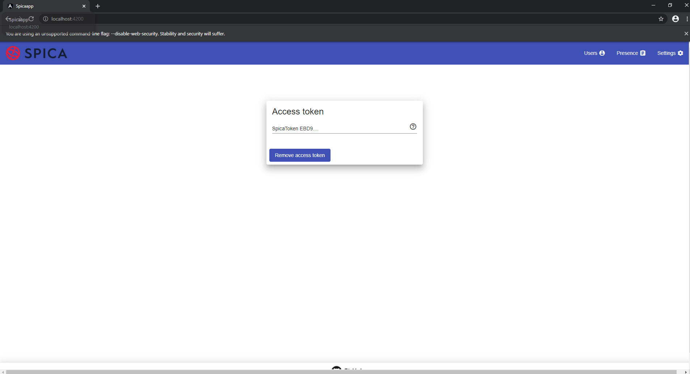
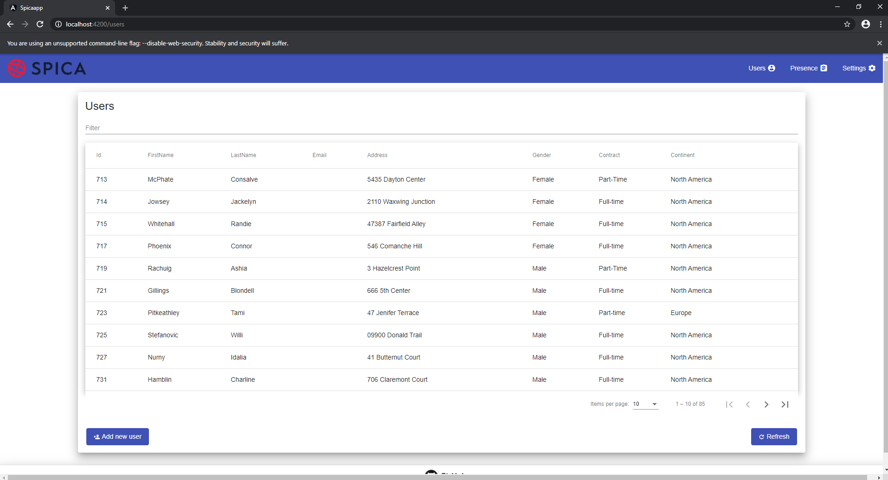
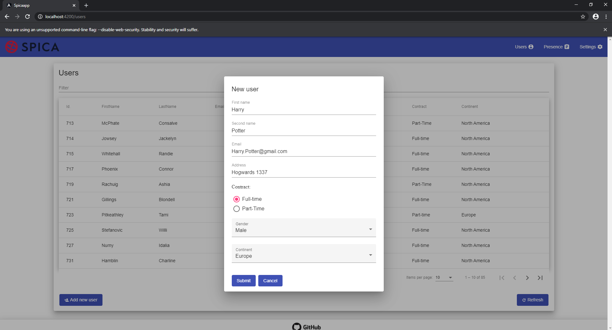
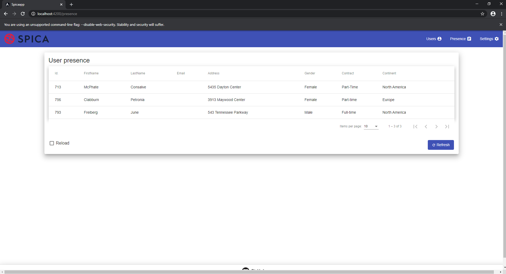

<h1 align="center">
  </a>
</h1>

<h2 align="center">ŠpicaApp</h2>

<p align="center">
  <a href="#about">About</a> ◈
  <a href="#prerequisites">Prerequisites</a> ◈
  <a href="#build-and-run">Build and run</a> ◈
  <a href="#how-to-test">How to test</a>
</p>

## About

A front-end SPA application built with [Angular](https://angular.io/). It uses access tokens to authenticate with the Time API service for data retrieval and [Angular Material](https://material.angular.io/) for UI.

This app is a result of a task given by [Špica](https://www.spica.si/) but it can also be used as a reference implementation for future projects.

## Prerequisites

You will need the following tools:

- [Node.js](https://nodejs.org/en/) (version 10 or later) with npm (version 6.4.1 or later)
- [Angular CLI](https://github.com/angular/angular-cli) (version 10.0.7 or later)
- [Visual Studio Code](https://code.visualstudio.com/) (optional)

## Build and run

1. Create a folder on local computer to clone the repo, something like `C:\source` will be fine.

2. Open cmd within newly created folder and clone the [SpicaApp repository from Github](https://github.com/PatriQ94/spicaapp)

   ```console
   git clone https://github.com/PatriQ94/spicaapp.git
   ```

3. Move to the root directory and install npm packages

   ```console
   cd spicaapp
   npm install
   ```

4. Run the application

   - For development and testing purposes:

     ```
     ng serve
     ```

   - For production:

     ```
     ng build
     ```
     The build artifacts will be stored in the dist/ directory. 
     Use the --prod flag for a production build.

5. Hit Windows Key + R to open the Windows ``Run`` window and run the following command:
   ```console
   chrome.exe --user-data-dir="D:/Chrome dev session" --disable-web-security
   ```
   This command will open up Google Chrome with disabled web security. This is a workaround to bypass CORS protection required by Time API.

6. Launch [http://localhost:4200](http://localhost:4200) within the Chrome opened in the previous point

## How to test

Once the application is up and running we are presented with the default - ``settings`` page.



Here we need to set a new access token in order to utilize other pages. The token gets automatically saved to the local storage upon changing the input field. We can also remove it from local storage by simply pressing the Remove button.

One the token is set we can visit the other two pages, one of which is the ``users`` page. 



On this page we can see the full list of users provided by the Time API. We are also provided with the options of refreshing the list, filtering the table by keywords through the filter field positioned above the table, as well as adding new users to the database as we can see on the image below.



The second page we can visit is the ``presence`` page, which allows us to see which users are currently present.



Here we are provided with the options of refreshing the list of users, as well as checking the "Reload" check box, which will result in Time API recalculating presence information rather than using the cached ones.